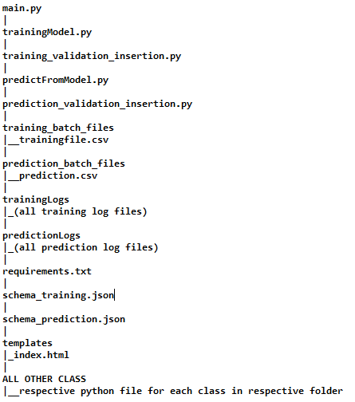
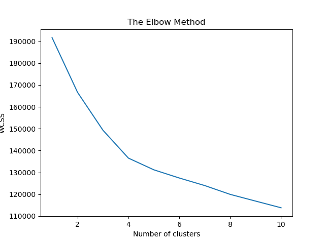
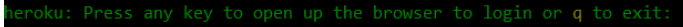

# Phishing-Website-Detector

## Contents 
- Overview
- Demo
- Project Motivation
- Data
- Project Structure
- Installation
- Running Project
- Model Selection
- Model Accuracy and Project reports
- Project Deployment
- Feature Request
- Tech Stack Used 
- About
- Credits
  
## Overview 
As over time, we have started to depend more on online services, cyber threats have been increasing with a faster rate. There are various websites which involves the usage of sensitive data of users like Online Banking, E-commerce or Social Networking, these websites are used everyday by millions of users and this opens a door for a **Phishing attack**.
  A website similar to the legit website is made and there is a high chance for a users to get fooled by it and enter their valuable info and credentials.
In this project, i have built a phishing website detection system with Machine Learning which is trained on multiple model and achieving an accuracy of 98%. It analysis the data over various aspects and classifies a website into **3 main categories** :
1. Legitimate
2. Suspecious
3. Phishing

## Demo 
Demo for this project : 

## Motivation and Aim
I am highly fascinated by the performance of data analysis and data science which is producing smart strategies in almost every domain and sector, be it industry , education, medical field or securtiy. We are able to take a much more efficient decision by inculcating many different forms of A.I in our systems.
Secondly, i got motivated to work on this project because currently it is the fastest time when from small scaled bussiness to large MNCs , every one is shifting their services online to the web. So it has become more vunerable to different cyber attacks, hence a system is needed for many companies to incorporate with their own systems, to take care of phishing attacks on their customers. 

The aim of this project is the efficiently reduce the cyber threats and specificely phishing, so that people may be more safe while using their sensitive information oer the web. This project is built on a full fledged , ene to end **industry based approach**. So it is not only useful to common man , but more of use to a company who provides online serices to their customers to incorporate with their systems , spread awareness and safety. 

## Project Structure

This project is class based model built on the top of **OOPs concepts** along with end to end **Exception/Error handeling** and **application logging** and stored in a **SQLite Database**
This project is mostly structured with Classes which are all at the same level. Each class is made into a different python file with it's member functions and each of the file is stored in a different directory.

So for every class , their goes a respective python file , in a respective directory/folder. 

i.e  **any class** --> **respective directory** --> **.py file**

Following is the **Directory Tree** of the project : 

## Working Flow 

**Note** : At every step, the following sequence is always followed :
1. an object of the class "Application logging" is created.
2. A repective file object is created in trainingLogs directory
3. Each step of execution is logged in the file, if there is an error, the exception is displayed, otherwise the step is marked as successfull

---

The project work flow is divided into 3 main parts : 

**1. Training :** 
  
  a. Data validation
  
  b. Data transformation
  
  c. DataBase operations
  
  d. Data preprocessing
  
  e. Data clustering
  
  f. Model selection and tuning
  
  ---
  
**2. Prediction :**
  
  a. Data validation
  
  b. Data transformation
  
  c. DataBase operations
  
  d. Data preprocessing
  
  e. Data clustering
  
  f. prediction
  
  ---
    
**3. Deployment on Heroku**

## Data : 

The data set used for training has **30 features** and **11056 rows.**

check the data [here](https://github.com/ayush237/Phising-Detector/blob/master/phising.csv)

The data entry for each fature has been incoded between 3 values **[-1,0,1]** as per their values

Also, the data is first validated using the schema file , check [here](https://github.com/ayush237/Phising-Detector/blob/master/schema_training.json) for the features list of data along with their decided structure/naming-convenction 

## Installation : 

Following are the steps to install the project in a **Windows system** : 
 
 1. Create a virtual environment 
 
 >  **using anaconda distribution** : `conda create -n name-of-your-environment`
 
 
 >  **using pip** : `py -m venv env`

 2. Install the packages : 
 
 > `pip install -r requirements.txt`
 
Following are the steps to install the project in a **MacOS/Linux system** :

1. Create a virtual environment 

> `python3 -m pip install --user virtualenv`

2. Install the packagea :

> `python -m pip install -r requirements.txt`

**Note** : I don't specifically know about this issue related to matplotlib, but if you face something like that, kindly check it here : [https://stackoverflow.com/questions/41457612/how-to-use-requirements-txt-to-install-all-dependencies-in-a-python-project](https://stackoverflow.com/questions/41457612/how-to-use-requirements-txt-to-install-all-dependencies-in-a-python-project)

## Running the project :

run the main.py file to start the Flask application on your localhost

> `python main.py`

## Model Selection : 

The project is dealt with both supervised and unsupervised approaches.
First of all, i have applied **Kmeans Clustering** on the data and divided the data into clusters and then i have selected a suitable model for each particular cluster between **XGBoost** and **Support Vector Machine** classifier. 

### Clustering the data : 

On applying the K-means Clustering Algorithm to the data, I found out that there are 4 no. of Clusters best suitable for the data i used. 

Following is the Elbow plot of the Data : 

So, 4 turns out to be the most suitable no. of clusters. 

### Predictive model Selection : 

On applying XGBoost and SVM on all clusters , it turns out that **XGBooot** is the most accurate model to use for each of the 4 clusters. 

### Accuracy :

After hyperparameter tuning, the final accuracy of all the models came ou to be **97.4 %** , which is quite satisfactory

## Deployment to Heroku

To make the project available to the end-users, i have deployed the project to Heroku cloud service provider. Below I discuss the steps to deploy the project on heroku cloud.

## Heroku account and CLI setup :

1. Go to heroku.com and create an account if you don't have one
2. Download  Heroku CLI from [here](https://devcenter.heroku.com/articles/heroku-cli)
3. Install the CLI on your system

## Deployment : 

1. Add a file called ‘gitignore’ inside the project folder. This folder contains the list of the files which we don’t want to include in the git repository. 
2. Add a file called ‘Procfile’ inside the project folder. This folder contains the command to run the flask application once deployed on the server, enter this code in procfile :

> `web: gunicorn main:app`

3. Open a command prompt window and navigate to your project folder. Enter the command ‘pip freeze > requirements.txt’. This command generates the ‘requirements.txt’ file.

4. Open a command prompt window and navigate to your project folder . Enter the following command : 

> `heroku login`

It should return an output like this : 

press any key to continue.

5. After logging in to Heroku, enter the command `heroku create` to create a heroku app. It will give you the URL of your Heroku app after successful creation.

6. Before deploying the code to the Heroku cloud, we need to commit the changes to the local git repository.

7. Type the command `git init` to initialize a local git repository as shown below:

8. Enter the command `git status` to see the uncommitted changes

9. Enter the command `git add .` to add the uncommitted changes to the local repository.

10. Enter the command `git commit -am "updated project"` to commit the changes to the local repository.

11. Enter the command `git push heroku master` to push the code to the heroku cloud.

12. After deployment, heroku gives you the URL to hit the web API.

13. Once your application is deployed successfully, enter the command `heroku logs --tail` to see the logs.

## Feature Request :

Currently, the project takes an input of csv file/files and outputs a prediction.csv file. But i would like to add a feature in which user can directly enter a url and check it instead of entering the features. This would require the project to collect all the features by itself from the url string entered.
I am working on this feature and have collected about 10 features , still some more remain

If interested Kindly help me implementing this feature !

## Tech Stack Used : 

       

      

  

## Credits :
> [https://www.researchgate.net/publication/328541785_Phishing_Website_Detection_using_Machine_Learning_Algorithms](https://www.researchgate.net/publication/328541785_Phishing_Website_Detection_using_Machine_Learning_Algorithms)

> [https://www.youtube.com/channel/UCb1GdqUqArXMQ3RS86lqqOw](https://www.youtube.com/channel/UCb1GdqUqArXMQ3RS86lqqOw)

> [https://link.springer.com/chapter/10.1007%2F978-981-15-5341-7_42](https://link.springer.com/chapter/10.1007%2F978-981-15-5341-7_42)

> [https://towardsdatascience.com/phishing-domain-detection-with-ml-5be9c99293e5](https://towardsdatascience.com/phishing-domain-detection-with-ml-5be9c99293e5)

 

